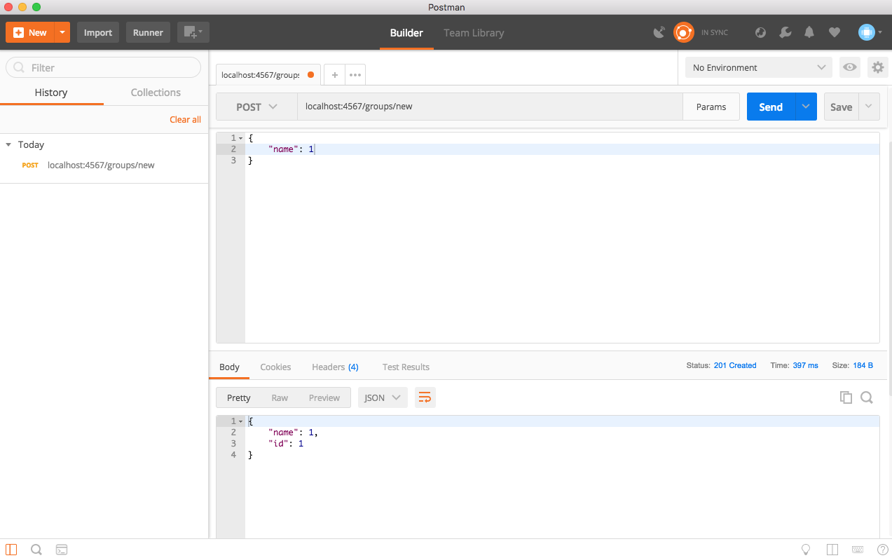

# _Periodic Table_

#### _A web application for Java week 4 @ Epicodus, Jan. 26, 2018_

#### By _**Zach Evans**_

## Description

_This is code for the beginning of an API for the periodic table of elements._

## Setup/Installation Requirements

* _This project can be accessed [here](https://github.com/ZEvans1/periodic-table-api.git)_
* _Clone the repository to your machine_
* _Open the project an app like IntelliJ_
* _Run the App.java file_

## Known Bugs

_Currently none_

## Support and contact details

_Contact email: zte.zachary@gmail.com_

## Technologies Used

* _Java_
* _IntelliJ_
* _SQL_
* _Spark_
* _H2_
* _Postman_
_A screen shot is shown below of how Postman was used to test routes within the App.java file._

