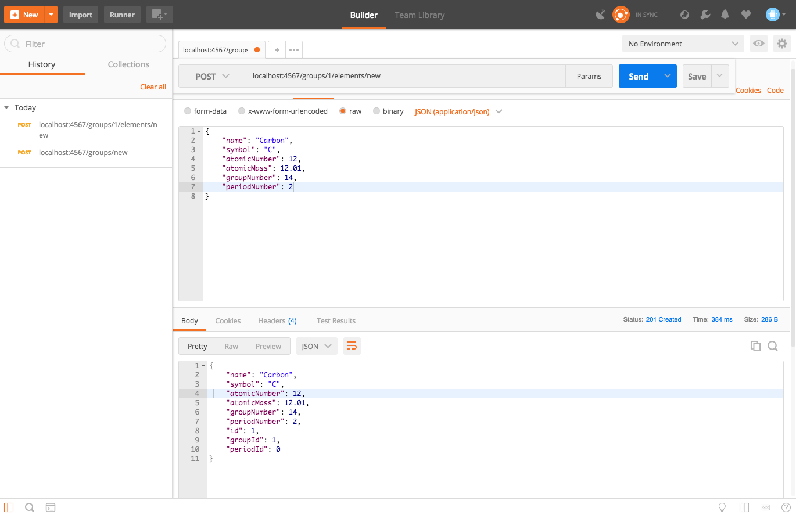

# _Periodic Table_

#### _A web application for Java week 4 @ Epicodus, Jan. 26, 2018_

#### By _**Zach Evans**_

## Description

_This is code for the beginning of an API for the periodic table of elements. Using REST, the following actions are currently possible:_

* _Create groups for the table (columns)_
* _Create periods for the table (rows)_
* _Create elements_
* _View groups, periods, or elements
* _Assign elements to groups

_Next steps are:_

* _Assign elements to periods_
* _Allow sorting of elements (atomic number, atomic mass, alphabetical, etc)_

_This was designed so that additional properties like electron configuration or isotopes could be easily added to the objects and database later on._

## Setup/Installation Requirements

* _This project can be accessed [here](https://github.com/ZEvans1/periodic-table-api.git)_
* _Clone the repository to your machine_
* _Open the project an app like IntelliJ_
* _Run the App.java file_

## Known Bugs

_Currently none_

## Support and contact details

_Contact email: zte.zachary@gmail.com_

## Technologies Used

* _Java_
* _IntelliJ_
* _SQL_
* _Spark_
* _H2_
* _Postman_
_Screen shots below show how Postman was used to test routes within the App.java file. Specifically, they show how to create a new group and a new element._

